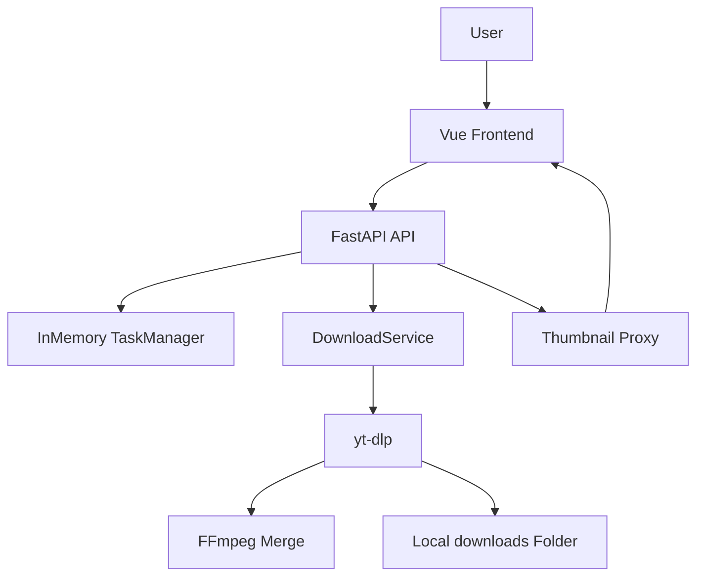
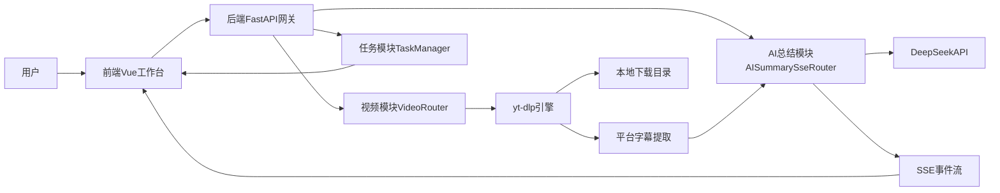
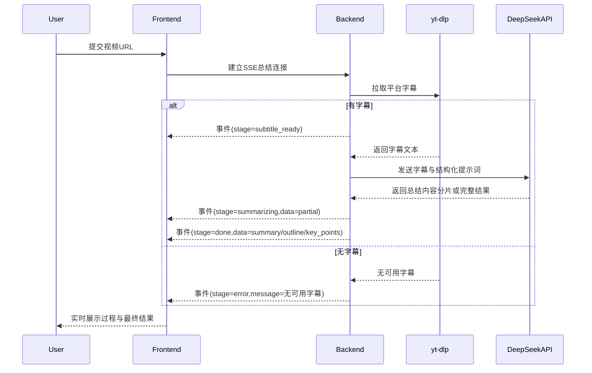

# 万能视频下载站 - 方案设计文档

## 1. 设计目标

- 用最小实现成本跑通“解析 -> 下载 -> 本地落盘 -> 状态反馈”闭环
- 站在开源项目基础上封装，不直接改动 yt-dlp 源码
- 保持架构轻量，便于快速接入后续高级能力

## 2. 总体架构

前端采用 Vue3 + Vite，后端采用 FastAPI，下载核心引擎为 yt-dlp。

## 3. 技术选型

- 前端：`Vue 3` + `Vite`
- 后端：`FastAPI` + `Uvicorn`
- 下载引擎：`yt-dlp` Python 嵌入
- 并发执行：`ThreadPoolExecutor`
- 任务状态：进程内内存字典（无 DB）
- 多媒体合并：项目内置 `ffmpeg`（`tools/ffmpeg-master-latest-win64-gpl/bin`）

## 4. 模块设计

## 4.1 后端模块

- `api/main.py`
  - 应用入口
  - CORS 配置
  - 健康检查
  - 路由挂载

- `api/routers/video.py`
  - 视频业务 API
  - 任务创建与状态查询
  - 字幕文件下载（TXT/SRT/VTT）
  - 缩略图代理
  - 打开本地路径
  - 运行时配置查询

- `api/routers/ai_summary.py`
  - AI 总结 SSE API
  - 流式阶段事件输出（`stage/delta/partial_result/result/error/done`）
  - 总结异常归一化

- `api/services/downloader.py`
  - yt-dlp 信息解析
  - 下载执行与进度回调
  - 格式策略计算（自动补音频）
  - 输出文件存在性校验
  - ffmpeg 路径检测

- `api/services/tasks.py`
  - 任务模型管理
  - 状态更新
  - 并发限制信号量

- `api/services/subtitle_extractor.py`
  - 平台字幕提取（优先 `yt-dlp` 字幕字段）
  - B 站字幕 API 兜底提取（`view + player/wbi/v2`）
  - 字幕文本标准化

- `api/services/ai_summary.py`
  - DeepSeek 流式调用
  - JSON 结构化解析（`summary/outline/key_points/mindmap_mermaid`）
  - 代理与 TLS 兼容配置

## 4.2 前端模块

- `frontend/src/App.vue`
  - 单条/批量模式切换（下载台）
  - 链接解析与格式选择
  - 解析后自动触发 AI 总结（下载台与总结区合并）
  - AI 结果区页签（总结摘要/章节总结/思维导图/字幕内容）
  - 思维导图全屏预览 + SVG 导出
  - 字幕分段展示与字幕文件下载入口
  - 任务进度可视化与“打开文件位置”
  - 缩略图加载（经后端代理）

## 5. 关键业务策略

## 5.1 格式选择策略

- 默认下载：`bv*+ba/b`
- 若用户显式选择 `format_id`：
  - 仅视频：自动转为 `<format_id>+bestaudio/b`
  - 仅音频：自动转为 `bestvideo+<format_id>/b`
  - 音视频完整：按用户选择直接下载

该策略用于避免“下载后无声”问题。

## 5.2 文件命名与落盘策略

- 输出模板：`%(id)s_%(title).80s.%(ext)s`
- 开启 `restrictfilenames`，减少路径编码差异
- 完成后强校验文件是否存在；不存在即判定失败

## 5.3 任务一致性策略

- 任务状态机：`queued -> running -> success/failed`
- 任务成功必须满足：下载流程完成 + 文件真实存在

## 5.4 缩略图显示策略

- 后端对 `thumbnail` URL 做协议标准化（优先 https）
- 前端不直接请求第三方封面，统一通过 `/api/video/thumbnail` 代理

## 6. API 设计（当前）

- `GET /api/health`：健康检查
- `POST /api/video/inspect`：解析视频信息
- `POST /api/video/download`：创建单条下载任务
- `POST /api/video/download/batch`：创建批量下载任务
- `GET /api/video/tasks`：任务列表
- `GET /api/video/tasks/{task_id}`：任务详情
- `GET /api/video/config`：运行配置（下载目录）
- `POST /api/video/open-path`：打开本地路径
- `GET /api/video/thumbnail`：封面代理
- `POST /api/video/subtitles/download`：下载字幕文件（`txt/srt/vtt`）
- `POST /api/ai-summary/stream`：AI 总结 SSE 流式输出

## 7. 当前限制

- 任务状态仅存内存，服务重启后丢失
- 缺少用户隔离与权限控制
- 依赖本地运行环境，不是生产级多租户部署

## 8. 扩展设计建议

## 8.1 数据层引入

- 引入 PostgreSQL：
  - 用户、任务、订阅、操作日志表
  - 支持任务历史查询和运营统计

## 8.2 异步任务队列

- 引入 Redis + Celery/RQ：
  - 异步下载 worker
  - 可扩展并发
  - 可重试与死信处理

## 8.3 支付与会员

- 引入 Stripe：
  - 订阅套餐
  - Webhook 同步权益
  - 下载配额/并发限制

## 8.4 AI 增值能力

- 视频总结：下载后提取平台字幕 + 摘要（V1 不启用 Whisper）
- 字幕翻译：支持多语言导出
- 可按任务后处理 Pipeline 实现（下载 -> 平台字幕提取 -> 总结/翻译）

## 8.5 移动端体验

- 前端响应式优化
- 任务状态推送（轮询可升级 WebSocket）
- 下载结果分享与本地管理入口

## 9. 测试策略

- 单元测试：下载服务的格式策略与错误归一化
- 接口测试：任务创建、状态流转、异常场景
- E2E 测试：真实链接解析与下载、文件存在性验证

## 10. 里程碑建议

- M1：稳定下载闭环（已完成）
- M2：账号 + DB + 历史任务
- M3：会员支付 + 配额体系
- M4：AI 总结/字幕翻译
- M5：生产化部署与监控告警

## 11. AI 视频总结 V1 专项方案（DeepSeek）

### 11.1 目标与范围

- 目标：帮助用户快速理解长视频内容，输出结构化学习结果。
- V1 输出：`summary`（摘要）、`outline[]`（大纲）、`key_points[]`（核心知识点）、`mindmap_mermaid`（思维导图）、`subtitle_segments[]`（时间戳字幕）。
- 模型：DeepSeek 官方 API，默认 `deepseek-chat`。
- 字幕策略：仅提取平台已有字幕，V1 不接入 Whisper 音频转写。
- 交互方式：仅使用 SSE API 流式输出，V1 不使用 AI 总结任务轮询。

### 11.2 整体架构

### 11.3 模块职责

- 用户
  - 输入视频链接，发起下载或 AI 总结任务。
  - 查看任务状态、摘要结果和失败原因。
- 前端（Vue）
  - 统一工作台入口，支持下载与总结并行操作。
  - 发起 SSE 请求并实时渲染阶段状态与结构化结果。
  - Mermaid 思维导图可视化渲染，语法异常时自动兜底重建导图。
  - 展示可读错误提示（如“当前视频无可用字幕”）。
- 后端（FastAPI）
  - 提供 SSE 总结 API，编排字幕提取与总结调用。
  - 负责 SSE 事件分片输出与错误归一化。
- yt-dlp
  - 负责视频信息解析、下载和平台字幕提取。
  - 当字幕字段为空时，由后端触发 B 站字幕 API 兜底。
- DeepSeekAPI
  - 基于字幕文本与提示词模板生成结构化总结结果。
- 任务模块（TaskManager）
  - 管理 `queued/running/success/failed` 状态。
  - 当前仅用于下载任务；AI 总结走 SSE 流式链路。

### 11.4 核心数据流

### 11.5 推荐落地目录

- `api/routers/video.py`：保留下载能力。
- `api/routers/ai_summary.py`：新增 AI 总结 SSE 接口。
- `api/services/subtitle_extractor.py`：平台字幕提取。
- `api/services/ai_summary.py`：DeepSeek 调用与结果结构化。
- `api/services/tasks.py`：继续服务下载任务状态管理。

### 11.8 输出 Schema（SSE result）

- `summary: string`
- `outline: string[]`
- `key_points: string[]`
- `mindmap_mermaid: string`
- `subtitle_text: string`
- `subtitle_segments: { start: number, end: number, text: string }[]`

### 11.6 运行配置（新增）

- DeepSeek：
  - `DEEPSEEK_API_KEY`
  - `DEEPSEEK_BASE_URL`
  - `DEEPSEEK_MODEL`
  - `DEEPSEEK_TIMEOUT_SECONDS`
  - `DEEPSEEK_PROXY_URL`（可选，显式代理）
- 字幕提取：
  - `YTDLP_COOKIEFILE`（可选，cookie.txt 文件路径）
  - `YTDLP_COOKIES_FROM_BROWSER`（可选，从浏览器读取）

### 11.7 当前实现状态（已完成）

- 已实现 SSE 总结接口并接入前端流式渲染。
- 已实现平台字幕优先提取，不启用 Whisper。
- 已实现 B 站字幕 API 兜底，修复“视频有字幕但提取为空”的问题。
- 已修复前端阶段状态在完成后停留 `summarizing` 的显示问题。
- 已新增 `partial_result` 事件，支持 `summary/key_points` 结构化流式预览。
- 已支持字幕文件下载接口（TXT/SRT/VTT）并接入前端字幕页签下载按钮。
- 已完成下载台与 AI 总结区一体化：解析成功后自动触发总结并同屏展示。
- 已支持思维导图全屏预览与 SVG 下载；高清 PNG 由于浏览器兼容性问题已下线。

## 12. 并行扩展功能沉淀（2026-03）

### 12.1 本轮目标与落地结果

- 目标 1：思维导图区域阅读优化
  - 落地：支持全屏预览；支持导出 SVG。
  - 说明：高清 PNG 多浏览器环境存在画布污染与渲染偏差，当前版本下线 PNG，优先保证稳定可用。
- 目标 2：字幕独立下载
  - 落地：后端新增 `POST /api/video/subtitles/download`，格式支持 `txt/srt/vtt`。
  - 落地：前端在“字幕内容”页签中提供下载按钮。
- 目标 3：下载台与 AI 总结合并
  - 落地：单条链接在下载台解析成功后自动发起 AI 总结请求。
  - 落地：解析信息、下载操作、AI 结果保持同屏工作流。
- 目标 4：结构化流式输出
  - 落地：SSE 在 `delta` 之外新增 `partial_result`。
  - 落地：前端“总结”“核心要点”支持流式刷新，不必等待最终 `result`。

### 12.2 工程性增强

- CORS 放宽本地开发端口正则，解决 Vite 端口漂移导致的 `Failed to fetch`。
- B 站 URL 解析增加规范化处理，减少历史追踪参数引发的不稳定行为。

