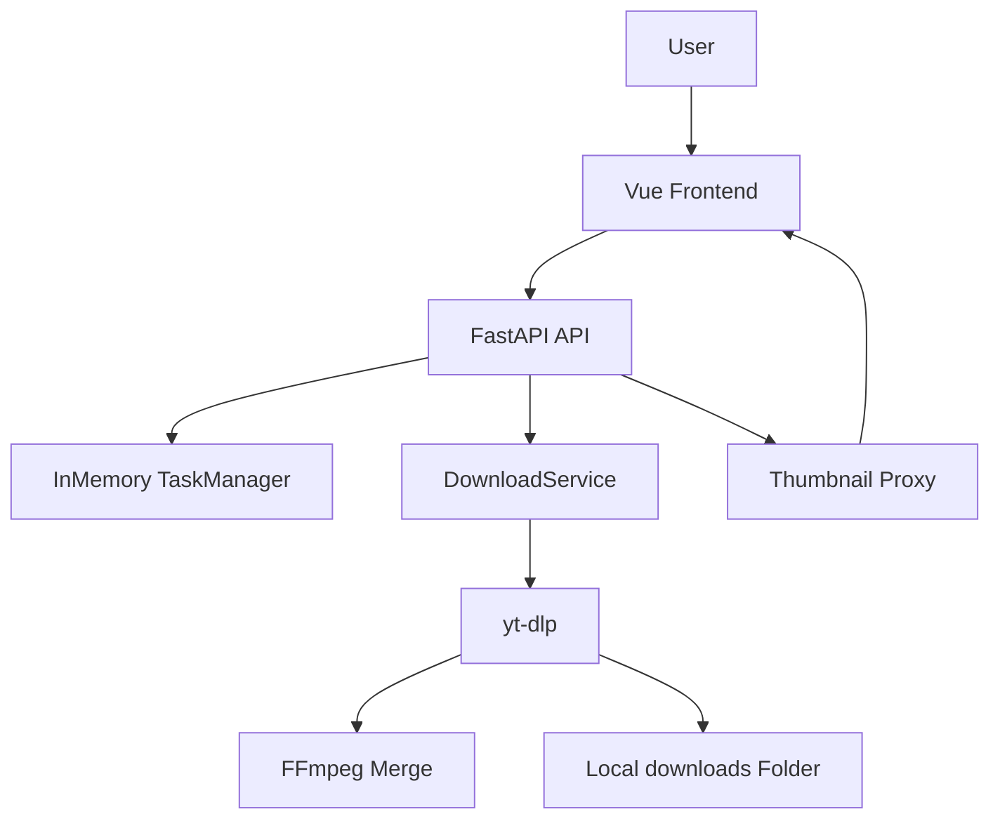

# 万能视频下载站 - 方案设计文档

## 1. 设计目标

- 用最小实现成本跑通“解析 -> 下载 -> 本地落盘 -> 状态反馈”闭环
- 站在开源项目基础上封装，不直接改动 yt-dlp 源码
- 保持架构轻量，便于快速接入后续高级能力

## 2. 总体架构

前端采用 Vue3 + Vite，后端采用 FastAPI，下载核心引擎为 yt-dlp。

## 3. 技术选型

- 前端：`Vue 3` + `Vite`
- 后端：`FastAPI` + `Uvicorn`
- 下载引擎：`yt-dlp` Python 嵌入
- 并发执行：`ThreadPoolExecutor`
- 任务状态：进程内内存字典（无 DB）
- 多媒体合并：项目内置 `ffmpeg`（`tools/ffmpeg-master-latest-win64-gpl/bin`）

## 4. 模块设计

## 4.1 后端模块

- `api/main.py`
  - 应用入口
  - CORS 配置
  - 健康检查
  - 路由挂载

- `api/routers/video.py`
  - 视频业务 API
  - 任务创建与状态查询
  - 缩略图代理
  - 打开本地路径
  - 运行时配置查询

- `api/services/downloader.py`
  - yt-dlp 信息解析
  - 下载执行与进度回调
  - 格式策略计算（自动补音频）
  - 输出文件存在性校验
  - ffmpeg 路径检测

- `api/services/tasks.py`
  - 任务模型管理
  - 状态更新
  - 并发限制信号量

## 4.2 前端模块

- `frontend/src/App.vue`
  - 单条/批量模式切换
  - 链接解析与格式选择
  - 任务进度可视化
  - 文件路径展示与“打开文件位置”触发
  - 缩略图加载（经后端代理）

## 5. 关键业务策略

## 5.1 格式选择策略

- 默认下载：`bv*+ba/b`
- 若用户显式选择 `format_id`：
  - 仅视频：自动转为 `<format_id>+bestaudio/b`
  - 仅音频：自动转为 `bestvideo+<format_id>/b`
  - 音视频完整：按用户选择直接下载

该策略用于避免“下载后无声”问题。

## 5.2 文件命名与落盘策略

- 输出模板：`%(id)s_%(title).80s.%(ext)s`
- 开启 `restrictfilenames`，减少路径编码差异
- 完成后强校验文件是否存在；不存在即判定失败

## 5.3 任务一致性策略

- 任务状态机：`queued -> running -> success/failed`
- 任务成功必须满足：下载流程完成 + 文件真实存在

## 5.4 缩略图显示策略

- 后端对 `thumbnail` URL 做协议标准化（优先 https）
- 前端不直接请求第三方封面，统一通过 `/api/video/thumbnail` 代理

## 6. API 设计（当前）

- `GET /api/health`：健康检查
- `POST /api/video/inspect`：解析视频信息
- `POST /api/video/download`：创建单条下载任务
- `POST /api/video/download/batch`：创建批量下载任务
- `GET /api/video/tasks`：任务列表
- `GET /api/video/tasks/{task_id}`：任务详情
- `GET /api/video/config`：运行配置（下载目录）
- `POST /api/video/open-path`：打开本地路径
- `GET /api/video/thumbnail`：封面代理

## 7. 当前限制

- 任务状态仅存内存，服务重启后丢失
- 缺少用户隔离与权限控制
- 依赖本地运行环境，不是生产级多租户部署

## 8. 扩展设计建议

## 8.1 数据层引入

- 引入 PostgreSQL：
  - 用户、任务、订阅、操作日志表
  - 支持任务历史查询和运营统计

## 8.2 异步任务队列

- 引入 Redis + Celery/RQ：
  - 异步下载 worker
  - 可扩展并发
  - 可重试与死信处理

## 8.3 支付与会员

- 引入 Stripe：
  - 订阅套餐
  - Webhook 同步权益
  - 下载配额/并发限制

## 8.4 AI 增值能力

- 视频总结：下载后自动语音转文本 + 摘要
- 字幕翻译：支持多语言导出
- 可按任务后处理 Pipeline 实现（下载 -> 转录 -> 总结/翻译）

## 8.5 移动端体验

- 前端响应式优化
- 任务状态推送（轮询可升级 WebSocket）
- 下载结果分享与本地管理入口

## 9. 测试策略

- 单元测试：下载服务的格式策略与错误归一化
- 接口测试：任务创建、状态流转、异常场景
- E2E 测试：真实链接解析与下载、文件存在性验证

## 10. 里程碑建议

- M1：稳定下载闭环（已完成）
- M2：账号 + DB + 历史任务
- M3：会员支付 + 配额体系
- M4：AI 总结/字幕翻译
- M5：生产化部署与监控告警

